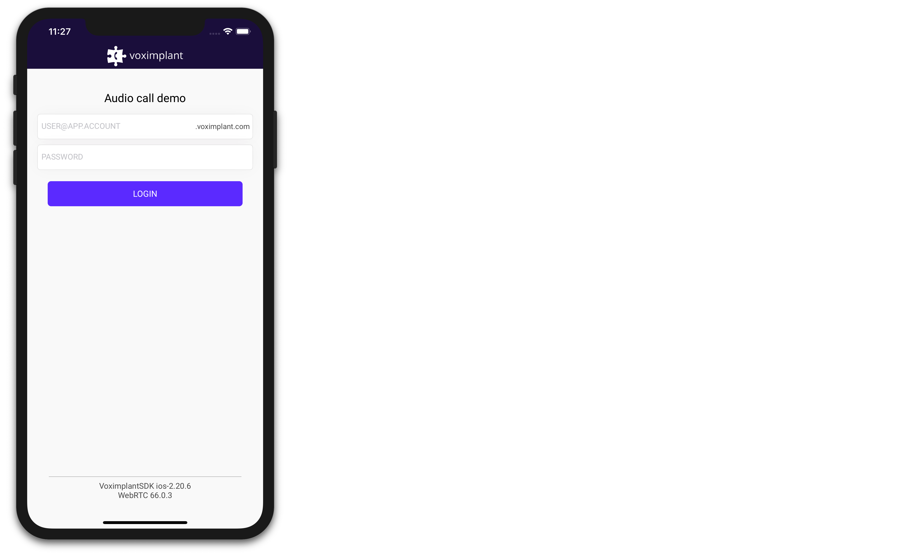
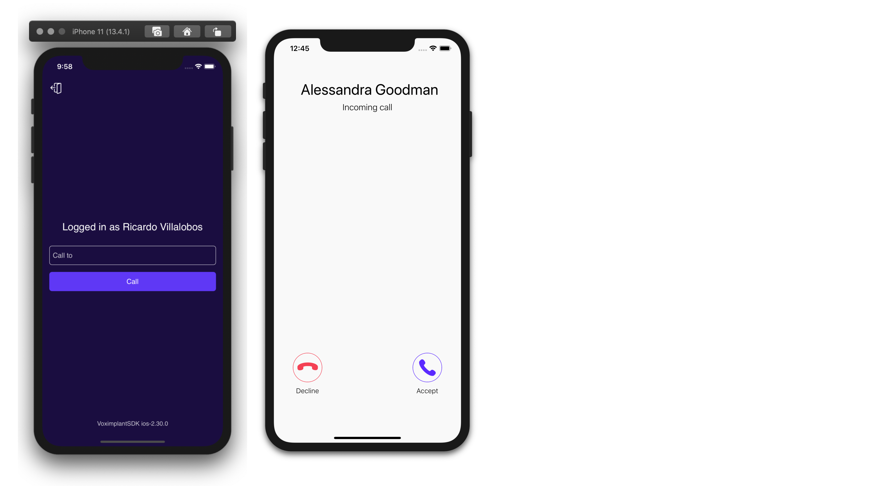
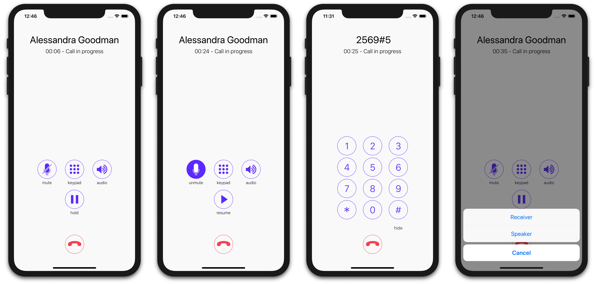

# Voximplant Audio Call Demo (iOS)

This demo demonstrates basic audio call functionality of the Voximplant iOS SDK. The application supports audio calls between this iOS app and other apps that use any Voximplant SDK.

> This demo application doesn't handle push notifications, so it doesn't receive incoming calls if the application is in the background or killed.

#### Features
The application is able to:
- log in to the Voximplant Cloud
- make an audio call
- receive an incoming call
- put a call on hold / take it off hold
- change an audio device (speaker, receiver, wired headset, bluetooth headset) during a call
- mute audio during a call
- send DTMF
- auto reconnect/relogin


## Getting started

To get started, you'll need to [register](https://voximplant.com) a free Voximplant developer account.

You'll need the following:
- Voximplant application
- two Voximplant users
- VoxEngine scenario
- routing setup

### Automatic
We've implemented a special template to enable you to quickly use the demo – just 
install [SDK tutorial](https://manage.voximplant.com/marketplace/sdk_tutorial) from our marketplace:


### Manual

You can set up it manually using our [quickstart guide](https://voximplant.com/docs/references/articles/quickstart) and tutorials

#### VoxEngine scenario example:
  ```
  VoxEngine.addEventListener(AppEvents.CallAlerting, (e) => {
  const newCall = VoxEngine.callUserDirect(
    e.call, 
    e.destination,
    e.callerid,
    e.displayName,
    null
  );
  VoxEngine.easyProcess(e.call, newCall, ()=>{}, true);
  });
  ```

## Installing

1. Clone this repo 

1. Run `$ pod install` in the repo folder

1. Open the `Swift.xcworkspace` workspace

1. Target AudioCall and build the project using Xcode

## Usage

### User login


Log in using:
* Voximplant user name in the format `user@app.account`
* password

See the following classes for code details:
- [AuthService.swift](AuthService.swift)
- [LoginViewController.swift](UI/Controllers/LoginViewController.swift)

### Make or receive calls


Enter a Voximplant user name to the input field and press "Call" button to make a call.

See the following classes for code details:
- [CallManager.swift](CallManager.swift)
- [MainViewController.swift](UI/Controllers/MainViewController.swift)
- [IncomingCallViewController.swift](UI/Controllers/IncomingCallViewController.swift)

### Audio call controls


Mute, hold, change an audio device or send DTMFs during a call.

See the following classes for code details:
- [CallViewController.swift](UI/Controllers/CallViewController.swift)
  

## Useful links
1. [Quickstart](https://voximplant.com/docs/references/articles/quickstart)
2. [Voximplant iOS SDK reference](https://voximplant.com/docs/references/iossdk)
3. [Using Voximplant iOS SDK](https://voximplant.com/docs/references/iossdk/using-ios-sdk)
4. [HowTo's](https://voximplant.com/blog/howto) 
