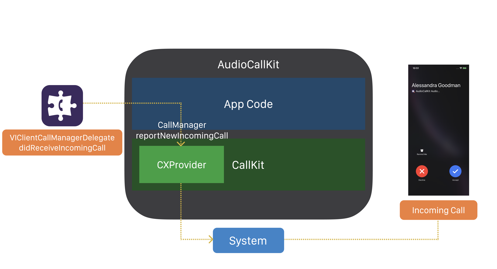

# Voximplant Audio Call Kit Demo (iOS)

This demo demonstrates [CallKit](https://developer.apple.com/documentation/callkit) integration with basic audio call functionality of the Voximplant iOS SDK . 
The application supports audio calls between this iOS app and other apps that use any Voximplant SDK.

> CallKit lets you integrate your calling services with other call-related apps on the system. 

> CallKit provides the calling interface, and you handle the back-end communication with your VoIP service. 

> For incoming and outgoing calls, CallKit displays the same interfaces as the Phone app, giving your app a more native look and feel. And CallKit responds appropriately to system-level behaviors such as Do Not Disturb.

> In addition to handling calls, you can provide a Call Directory app extension to provide caller ID information and a list of blocked numbers associated with your service.

#### Features
The application is able to:
- log in to the Voximplant Cloud
- make an audio call
- receive an incoming call
- put a call on hold / take it off hold
- change an audio device (speaker, receiver, wired headset, bluetooth headset) during a call
- mute audio during a call
- send DTMF
- auto reconnect/relogin
- push notifications 
- CallKit integration


## Getting started

To get started, you'll need to [register](https://voximplant.com) a free Voximplant developer account.

You'll need the following:
- Voximplant application
- two Voximplant users
- VoxEngine scenario
- routing setup
- VoIP services certificate for push notifications. Follow [this tutorial](https://voximplant.com/docs/references/iossdk/push-notifications-for-ios) to upload the certificate to the Voximplant Control Panel

### Automatic
We've implemented a special template to enable you to quickly use the demo – just 
install [SDK tutorial](https://manage.voximplant.com/marketplace/sdk_tutorial) from our marketplace:


### Manual

You can set up it manually using our [quickstart guide](https://voximplant.com/docs/references/articles/quickstart) and tutorials

#### VoxEngine scenario example:
  ```
  require(Modules.PushService);
  VoxEngine.addEventListener(AppEvents.CallAlerting, (e) => {
  const newCall = VoxEngine.callUserDirect(
    e.call, 
    e.destination,
    e.callerid,
    e.displayName,
    null
  );
  VoxEngine.easyProcess(e.call, newCall, ()=>{}, true);
  });
  ```

## Installing

1. Clone this repo 

1. Run `$ pod install` in the repo folder

1. Open the `Swift.xcworkspace` workspace

1. Target AudioCallKit and build the project using Xcode

## Usage

### User login


Log in using:
* Voximplant user name in the format `user@app.account`
* password

After each successful login the demo app registers the VoIP push token via [VIClient.registerPushNotificationsToken(voipToken:imToken:)](https://voximplant.com/docs/references/iossdk/viclient#registerpushnotificationstokenimtoken)

See the following classes for code details:
* [AuthService.swift](AuthService.swift)
* [LoginViewController.swift](UI/Controllers/LoginViewController.swift)
* [PushCallNotifier.swift](PushCallNotifier.swift)

### CallKit integration architecture

CallManager.swift creates and stores `CXProvider` that is responsible for reporting out-of-band call notifications that occur to the system:
* incoming call
* outgoing call connected 
* call ended by the far-end

`CXCallController` is used to report call events generated by the current user:
* [MainViewController.swift](UI/Controllers/MainViewController.swift) uses `CXCallController` to report outgoing calls
* [CallViewController.swift](UI/Controllers/CallViewController.swift) uses `CXCallController` to request `CXTransactions` to change the call state (mute, hold, DTMFs, call end by the current user)

### Make or receive calls


Enter a Voximplant user name to the input field and press "Call" button to make a call.


To make an outgoing call, MainViewController requests a `CXStartCallAction` object from its `CXCallController` object. 
The action consists of a UUID to uniquely identify the call and a `CXHandle` object to specify the recipient.

CallManager implements `CXProviderDelegate` methods and processes `CXStartCallAction` by creating VICall instance.


To receive an incoming call from the Voximplant Cloud, CallManager implements [VIClientCallManagerDelegate](https://voximplant.com/docs/references/iossdk/viclientcallmanagerdelegate) and reports it to the CallKit using the `reportNewIncomingCall(with:update:completion:)` method


See the following classes for code details:
* [CallManager.swift](CallManager.swift)
* [MainViewController.swift](UI/Controllers/MainViewController.swift)

### Audio call controls


It is possible to synchronize the call states (such as audio mute, hold, audio device change) between CallKit UI and application call view using CallKit `CXCallController` and `CXProvider`.

See the following classes for code details:
* [CallViewController.swift](UI/Controllers/CallViewController.swift)
* [CallManager.swift](CallManager.swift)
  

## Useful links
1. [Quickstart](https://voximplant.com/docs/references/articles/quickstart)
2. [Voximplant iOS SDK reference](https://voximplant.com/docs/references/iossdk)
3. [Using Voximplant iOS SDK](https://voximplant.com/docs/references/iossdk/using-ios-sdk)
4. [Push Notifications](https://voximplant.com/docs/references/iossdk/push-notifications-for-ios)
5. [HowTo's](https://voximplant.com/blog/howto) 
6. [WWDC 2016 - Enhancing VoIP Apps with CallKit](https://developer.apple.com/videos/play/wwdc2016/230/)
