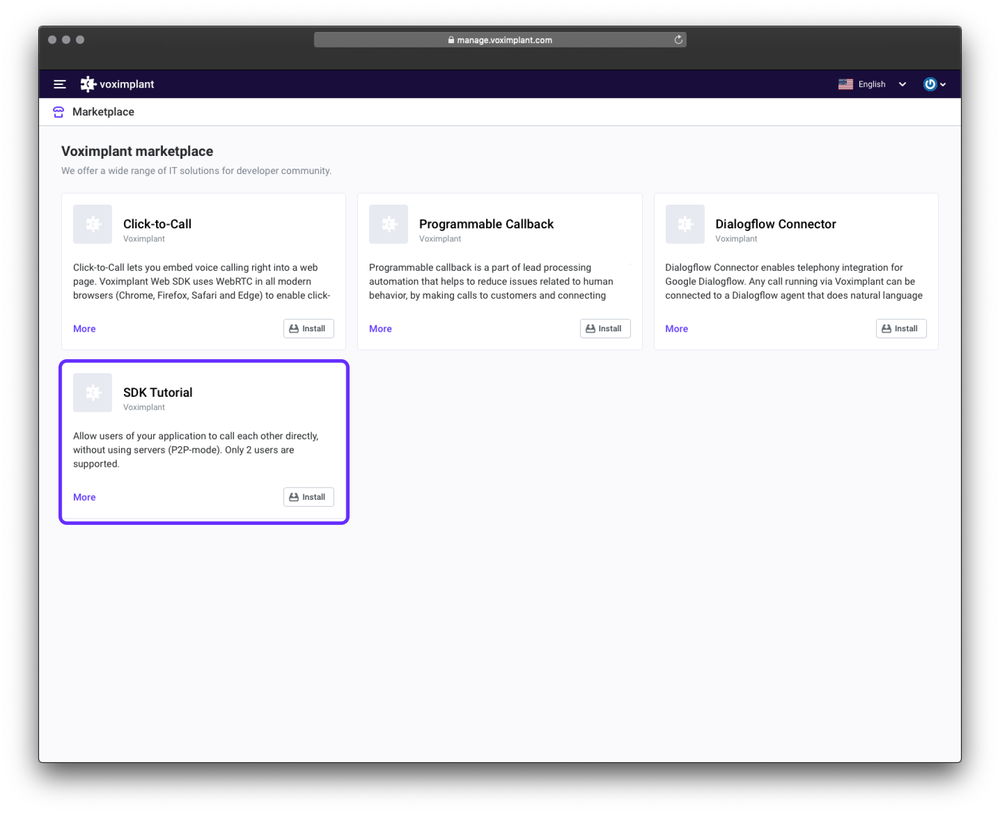

# Voximplant InApp Screen Sharing Demo (iOS)

This demo demonstrates basic in-app screen sharing functionality of the Voximplant iOS SDK. The application supports video calls between this iOS app and other apps that use any Voximplant SDK.

#### Features
The application is able to:
- log in to the Voximplant Cloud
- auto login using access tokens
- make an video call
- receive an incoming call
- switch camera during a call
- enable/disable video during a call
- enable/disable screen sharing during a call
- auto reconnect/relogin


## Getting started

To get started, you'll need to [register](https://voximplant.com) a free Voximplant developer account.

You'll need the following:
- Voximplant application
- two Voximplant users
- VoxEngine scenario
- routing setup
- VoIP services certificate for push notifications. Follow [this tutorial](https://voximplant.com/docs/references/iossdk/push-notifications-for-ios) to upload the certificate to the Voximplant Control Panel

### Automatic
We've implemented a special template to enable you to quickly use the demo – just 
install [SDK tutorial](https://manage.voximplant.com/marketplace/sdk_tutorial) from our marketplace:


### Manual

You can set up it manually using our [quickstart guide](https://voximplant.com/docs/references/articles/quickstart) and tutorials

#### VoxEngine scenario example:
  ```
  require(Modules.PushService);
  VoxEngine.addEventListener(AppEvents.CallAlerting, (e) => {
  const newCall = VoxEngine.callUserDirect(
    e.call, 
    e.destination,
    e.callerid,
    e.displayName,
    null
  );
  VoxEngine.easyProcess(e.call, newCall, ()=>{}, true);
  });
  ```

## Installing

1. Clone this repo 

2. Open the `Swift.xcodeproj` workspace

3. Target InAppScreenSharing and build the project using Xcode

## Usage

### User login


Log in using:
* Voximplant user name in the format `user@app.account`
* password

See the following classes for code details:
* [AuthService.swift](Services/AuthService.swift)
* [LoginViewController.swift](Stories/LoginViewController.swift)

### Make or receive calls


Enter a Voximplant user name to the input field and press "Call" button to make a call.

See the following classes for code details:
- [CallManager.swift](Services/CallManager.swift)
- [MainViewController.swift](Stories/MainViewController.swift)
- [IncomingCallViewController.swift](Stories/IncomingCallViewController.swift)

### Call controls


Enable/disable video or screen sharing during a call.

See the following classes for code details:
- [CallViewController.swift](Stories/CallViewController.swift)
* [CallManager.swift](Services/CallManager.swift)
  

## Useful links
1. [Getting started](https://voximplant.com/docs/introduction)
2. [Voximplant iOS SDK reference](https://voximplant.com/docs/references/iossdk)
3. [Installing the Voximplant iOS SDK](https://voximplant.com/docs/introduction/integration/adding_sdks/installing/ios_sdk)
4. [HowTo's](https://voximplant.com/docs/howtos) 
