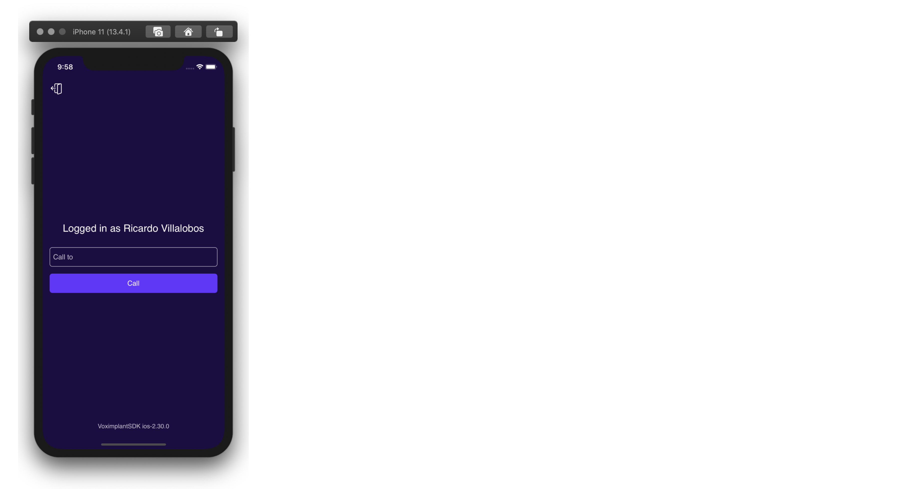
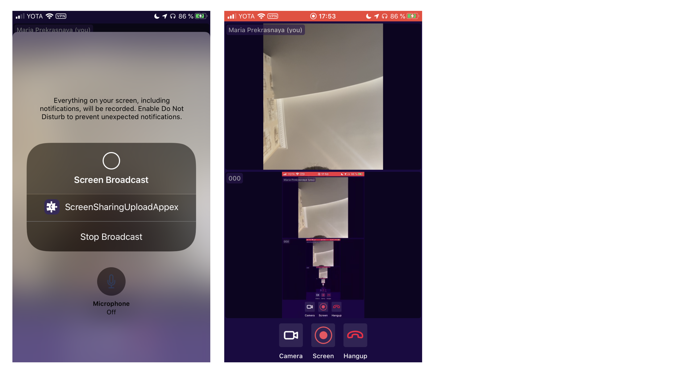

# Voximplant Screen Sharing Demo (iOS)

This demo demonstrates basic screen sharing functionality of the Voximplant iOS SDK. The application supports video calls between this iOS app and other apps that use any Voximplant SDK.

#### Features
The application is able to:
- log in to the Voximplant Cloud
- auto login using access tokens
- make an video conference call
- enable/disable video during a call
- enable/disable screen sharing during a call
- auto reconnect/relogin


## Getting started

To get started, you'll need to [register](https://voximplant.com) a free Voximplant developer account.

You'll need the following:
- Voximplant application
- two Voximplant users
- VoxEngine scenario
- routing setup

### Manual

You can set up it manually using our [quickstart guide](https://voximplant.com/docs/references/articles/quickstart) and tutorials

#### VoxEngine scenario example:
  ```
  var MediaStatistic = true;
  require("conference");
  require("recorder");
  var conf;
  var partsCounter = 0;
  var recorder;
  function checkForTermination() {
    if (partsCounter === 0) {
      conf.stop();
      conf = null;
      setTimeout(VoxEngine.terminate, 2000);
    }
  }
  VoxEngine.addEventListener(AppEvents.Started, function (e) {
    conf = VoxEngine.createConference({hd_audio:true});
    conf.addEventListener(ConferenceEvents.Stopped, function(e) {
      Logger.write("stopped");
    });
    conf.addEventListener(ConferenceEvents.Started, function(e) {
      Logger.write("started id=" + e.conference.getId());
    });
    conf.addEventListener(ConferenceEvents.EndpointAdded, function(e) {
      ++partsCounter;
    Logger.write("endpoint added pc = " + partsCounter);
    });
    conf.addEventListener(ConferenceEvents.EndpointRemoved, function(e) {
      --partsCounter;
      Logger.write("endpoint removed pc = " + partsCounter);
      if (partsCounter == 0) {
          setTimeout(checkForTermination, 1000*10); // wait for 10 ceconds
      }
    });
  });
  VoxEngine.addEventListener(AppEvents.CallAlerting, function (e) {
    e.call.answer();
    partsCounter = partsCounter + 1;
    const endpoint = conf.add({
      call: e.call,
      mode: "FORWARD",
      direction: "BOTH", scheme: e.scheme
    });
    Logger.write(`New endpoint was added ID: ${endpoint.id}`);
    function checkForTermination() {
      if (partsCounter === 0) {
        conf.stop();
        conf = null;
        }
    }
    function participantDisconnected() {
      partsCounter = partsCounter - 1;
      if (partsCounter === 0) {
        setTimeout(checkForTermination, 1000 * 10); // wait for 10 ceconds
      }
    }
    e.call.addEventListener(CallEvents.Disconnected, function (e) {
        participantDisconnected();
    });
  });
  ```

## Installing

1. Clone this repo 

2. Open the `Swift.xcodeproj` workspace

3. Target ScreenSharing and build the project using Xcode

## Usage

### User login


Log in using:
* Voximplant user name in the format `user@app.account`
* password

See the following classes for code details:
* [AuthService.swift](Services/AuthService.swift)
* [LoginViewController.swift](Stories/LoginViewController.swift)

### Make calls


Enter "myconf" to the input field and press "Call" button to join a conference.

See the following classes for code details:
- [CallManager.swift](Services/CallManager.swift)
- [MainViewController.swift](Stories/MainViewController.swift)

### Call controls


Enable/disable video or screen sharing during a call.

See the following classes for code details:
- [CallViewController.swift](Stories/CallViewController.swift)
* [CallManager.swift](Services/CallManager.swift)
  
  
## Broadcasting Architecture

Screen capture happens within an broadcast upload app extension.
look: [SampleHandler.swift](../ScreenSharingUploadAppex/SampleHandler.swift)

Every time user tries to begin screen sharing, extension receives ‘broadcastStarted’ method call, in which
app extension will try to auth into Voximplant Cloud 
(using locally stored auth tokens in app group User Defaults) and to begin another call which is used for delivery screen frames.

If an error occurs while doing so, broadcast upload app extension process will be ended and user will be notified about it with an alert.

CFNotificationCenter ([DarwinNotificationsService.swift](Services/DarwinNotificationsService.swift)) is used to send messages between the app and extension.

>  Please note, ios app extensions are highly restricted and has only 
50mb ram limit. Due to this reason it is possible only use hardware accelerated encoding (which is h264) and is not possible to use software accelerated (vp8).


## Useful links
1. [Getting started](https://voximplant.com/docs/introduction)
2. [Voximplant iOS SDK reference](https://voximplant.com/docs/references/iossdk)
3. [Installing the Voximplant iOS SDK](https://voximplant.com/docs/introduction/integration/adding_sdks/installing/ios_sdk)
4. [HowTo's](https://voximplant.com/docs/howtos) 
5. [About ReplayKit on WWDC](https://developer.apple.com/videos/play/wwdc2018/601/) 
